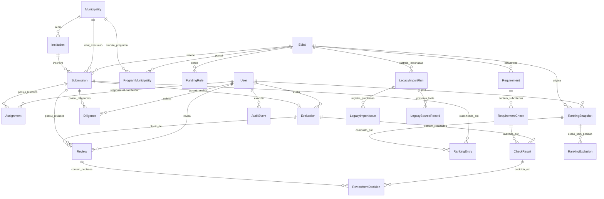

# Modelo de Domínio — Sistema de Gestão e Análise de Edital

Este documento descreve a arquitetura de entidades do sistema, seus relacionamentos e regras de integridade, substituindo a estrutura de abas e células do Excel legadão por um modelo relacional auditável em PostgreSQL.

---

## Diagrama Entidade-Relacionamento (ERD)

---

## Descrição dos Domínios e Entidades

### 1. Núcleo Institucional e Municípios (`apps.institutions`)
- **`Municipality`**: Nome/UF e código IBGE único quando resolvido. Legados sem código oficial mantêm `ibge_code=NULL`, com unicidade nome/UF para registros não resolvidos. Nenhum código é fabricado; a identidade textual ainda pode exigir saneamento.
- **`Institution`**: Representa a organização da sociedade civil proponente. O campo `cnpj` é validado e normalizado pelo módulo dedicado `apps.institutions.cnpj`, suportando tanto o padrão numérico clássico (14 dígitos) quanto a nova especificação alfanumérica da Receita Federal.

### 2. Parâmetros e Regras do Edital (`apps.editais`)
- **`Edital`**: Entidade versionável que armazena número, ano, vigência, status, versão de regras e política de duplicidade (`KEEP_EARLIEST_SUBMISSION` vs `KEEP_LATEST_SUBMISSION`). Garante que modificações futuras em editais novos não alterem retroativamente o histórico de editais encerrados.
- **`ProgramMunicipality`**: Mapeia a adesão de municípios a programas prioritários vinculados ao edital (ex: **PRONASCI**), base essencial para o enquadramento no Grupo 2 (G2).
- **`FundingRule`**: Regra por FEMALE/MALE/NURSING_MOTHER, valor mensal Decimal e duração. Percentual mínimo fica em Edital. `LegacyGroupFundingRule` conserva parâmetros antigos sem inferir sua conversão para tipos de vaga.
- **`Requirement`**: Requisitos formais (ex.: `4.2-I`, `4.2-V Estatuto`, `4.2-XVI`).
- **`RequirementCheck`**: Subcritérios atômicos de cada requisito (ex.: finalidade estatutária, ausência de remuneração de dirigentes, dissolução patrimonial).

### 3. Inscrições e Distribuição (`apps.submissions`)
- **`Submission`**: Registro unificado da inscrição, contendo processo SEI, data/hora de protocolo (`received_at`), vagas (femininas, masculinas, mães nutrizes), valores propostos, status de workflow e grupo preliminar.
- **`Assignment`**: Histórico de atribuição e redistribuição de processos aos analistas, registrando analista anterior, novo analista, responsável pela distribuição, timestamp e motivo.

### 4. Avaliação Documental (`apps.evaluations`)
- **`Evaluation`**: Análise conduzida pelo analista responsável, registrando status (`DRAFT`, `COMPLETED`), parecer calculado (`APTA`, `INAPTA`, `EM_ANALISE`) e códigos dos requisitos com pendência (`failed_requirement_codes`).
- **`CheckResult`**: Normalização individual por subcritério (status `ATENDE`, `NAO_ATENDE`, `NAO_ENVIADO`, `NAO_APLICAVEL`), número SEI do documento, folhas/páginas, data de validade de certidão, valor financeiro e notas. Substitui a dispersão de 80 colunas flat do Excel.

### 5. Revisão e Diligência (`apps.reviews`)
- **`Review`**: Criada automaticamente somente para INAPTA, inicialmente sem responsável. Claim atribui revisor distinto do analista; ownership e estado pendente controlam edição. Preserva a decisão PRE_HABILITADO/PRE_INABILITADO; decisões históricas continuam distintas do cálculo dos checks.
- **`ReviewItemDecision`**: Confirmação ou divergência item a item em relação ao parecer do analista, exigindo justificativa obrigatória em caso de discordância.
- **`Diligence`**: Novas operações exigem prazo e preservam estágio de origem/consequência expressa. Históricos incompletos conservam datas, prazo e solicitante nulos e estado LEGACY_UNKNOWN; cada linha repetida é um evento próprio.

### 6. Classificação e Ranking (`apps.ranking`)
- **`RankingSnapshot`**: Snapshot imutável gerado em determinada data de publicação, gravando a versão das regras, política de duplicidade e responsável pela geração.
- **`RankingEntry`**: Apenas candidatos elegíveis efetivamente ranqueados, com posições consecutivas por grupo e dados capturados no snapshot. Supressões ficam em RankingExclusion, sem posição oficial.
- **`RankingExclusion`**: Motivo, inscrição, duplicate_of e metadados separados das entradas. Snapshots e seus registros são protegidos por model/queryset/service/admin; SQL privilegiado não está coberto por essas barreiras.

### 7. Trilha de Auditoria (`apps.audit`)
- **`AuditEvent`**: Registro append-only do fluxo. Preserva a proteção existente de save/delete e admin; serviços críticos emitem eventos. Essa proteção não equivale a uma política de imutabilidade aplicada por triggers a todo SQL privilegiado.
